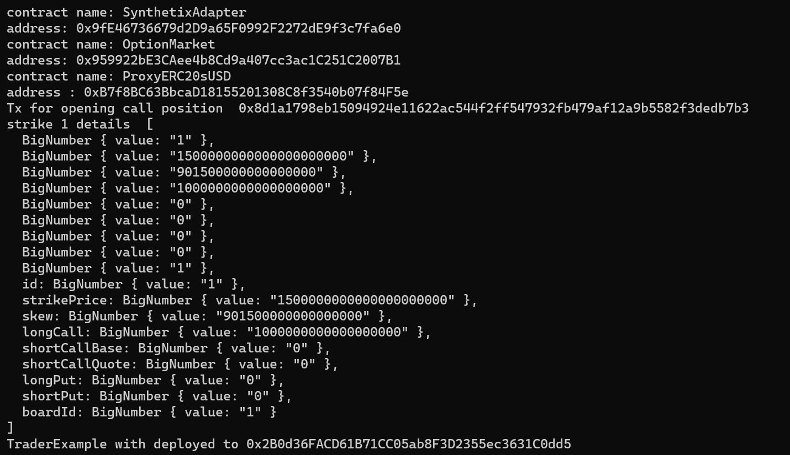
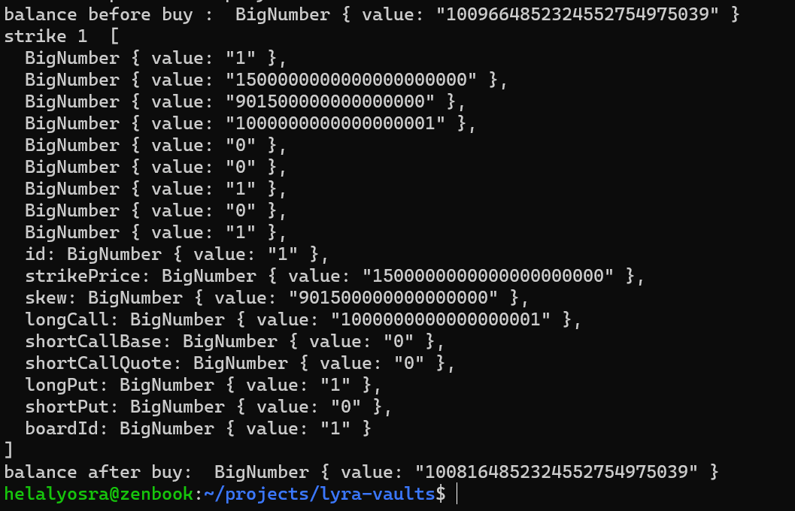

# Lyra finance project (for testing locally)

### Run hardhat node 
```
npx hardhat node
```

### Run script to test the workflow
```shell 
npx hardhat run scripts/lyraDeployLocal.ts --network local
```
### Trader.sol
is a lyraAdapter to perform some buy on the AMM

### Outputs 
```
contract name: SynthetixAdapter
address: 0x9fE46736679d2D9a65F0992F2272dE9f3c7fa6e0
contract name: OptionMarket
address: 0x959922bE3CAee4b8Cd9a407cc3ac1C251C2007B1
contract name: ProxyERC20sUSD
address : 0xB7f8BC63BbcaD18155201308C8f3540b07f84F5e
Tx for opening call position  0x8d1a1798eb15094924e11622ac544f2ff547932fb479af12a9b5582f3dedb7b3
strike 1 details  [
  BigNumber { value: "1" },
  BigNumber { value: "1500000000000000000000" },
  BigNumber { value: "901500000000000000" },
  BigNumber { value: "1000000000000000000" },
  BigNumber { value: "0" },
  BigNumber { value: "0" },
  BigNumber { value: "0" },
  BigNumber { value: "0" },
  BigNumber { value: "1" },
  id: BigNumber { value: "1" },
  strikePrice: BigNumber { value: "1500000000000000000000" },
  skew: BigNumber { value: "901500000000000000" },
  longCall: BigNumber { value: "1000000000000000000" },
  shortCallBase: BigNumber { value: "0" },
  shortCallQuote: BigNumber { value: "0" },
  longPut: BigNumber { value: "0" },
  shortPut: BigNumber { value: "0" },
  boardId: BigNumber { value: "1" }
]
TraderExample with deployed to 0x2B0d36FACD61B71CC05ab8F3D2355ec3631C0dd5
balance before buy :  BigNumber { value: "1009664852324552754975039" }
strike 1  [
  BigNumber { value: "1" },
  BigNumber { value: "1500000000000000000000" },
  BigNumber { value: "901500000000000000" },
  BigNumber { value: "1000000000000000001" },
  BigNumber { value: "0" },
  BigNumber { value: "0" },
  BigNumber { value: "1" },
  BigNumber { value: "0" },
  BigNumber { value: "1" },
  id: BigNumber { value: "1" },
  strikePrice: BigNumber { value: "1500000000000000000000" },
  skew: BigNumber { value: "901500000000000000" },
  longCall: BigNumber { value: "1000000000000000001" },
  shortCallBase: BigNumber { value: "0" },
  shortCallQuote: BigNumber { value: "0" },
  longPut: BigNumber { value: "1" },
  shortPut: BigNumber { value: "0" },
  boardId: BigNumber { value: "1" }
]
balance after buy:  BigNumber { value: "1008164852324552754975039" }
```

