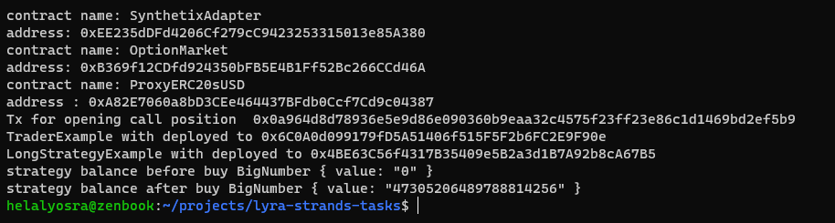
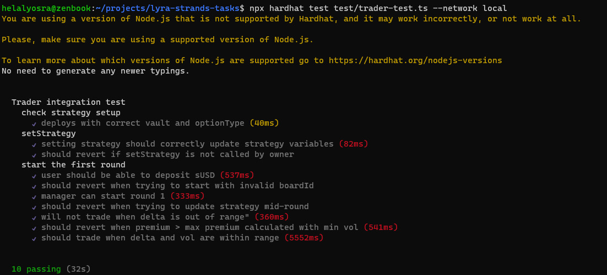

# Lyra finance project (for testing locally)

### Run hardhat node 
```
npx hardhat node
```

### Run script to test the workflow
```shell 
npx hardhat run scripts/lyraDeployLocal.ts --network local
```
### Trader.sol
is a lyraVault to perform some buy on the AMM

### LongStrategy.sol
is a strategy to perform a buy on the AMM from the vault 

### Script Outputs 
```
contract name: SynthetixAdapter
address: 0xEE235dDFd4206Cf279cC9423253315013e85A380
contract name: OptionMarket
address: 0xB369f12CDfd924350bFB5E4B1Ff52Bc266CCd46A
contract name: ProxyERC20sUSD
address : 0xA82E7060a8bD3CEe464437BFdb0Ccf7Cd9c04387
Tx for opening call position  0x0a964d8d78936e5e9d86e090360b9eaa32c4575f23ff23e86c1d1469bd2ef5b9
TraderExample with deployed to 0x6C0A0d099179fD5A51406f515F5F2b6FC2E9F90e
LongStrategyExample with deployed to 0x4BE63C56f4317B35409e5B2a3d1B7A92b8cA67B5
strategy balance before buy BigNumber { value: "0" }
```


### Run Tests and Outputs
```
npx hardhat test test/trader-test.ts --network local
```

