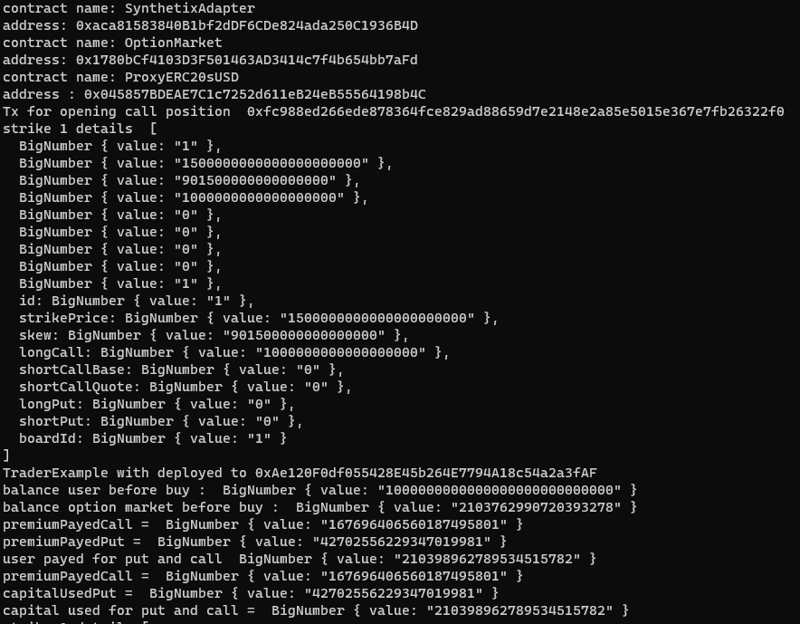
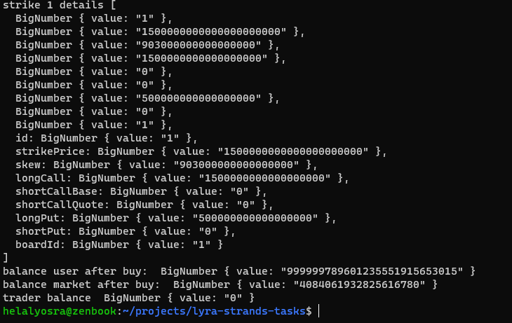

# Lyra finance project (for testing locally)

### Run hardhat node 
```
npx hardhat node
```

# First method - without vault
### SimpleTrader.sol
is a lyraAdapter to perform some buy on the AMM

### Script Outputs 
```shell 
npx hardhat run scripts/deploy.ts --network local
```
```
contract name: SynthetixAdapter
address: 0xaca81583840B1bf2dDF6CDe824ada250C1936B4D
contract name: OptionMarket
address: 0x1780bCf4103D3F501463AD3414c7f4b654bb7aFd
contract name: ProxyERC20sUSD
address : 0x045857BDEAE7C1c7252d611eB24eB55564198b4C
Tx for opening call position  0xfc988ed266ede878364fce829ad88659d7e2148e2a85e5015e367e7fb26322f0
strike 1 details  [
  BigNumber { value: "1" },
  BigNumber { value: "1500000000000000000000" },
  BigNumber { value: "901500000000000000" },
  BigNumber { value: "1000000000000000000" },
  BigNumber { value: "0" },
  BigNumber { value: "0" },
  BigNumber { value: "0" },
  BigNumber { value: "0" },
  BigNumber { value: "1" },
  id: BigNumber { value: "1" },
  strikePrice: BigNumber { value: "1500000000000000000000" },
  skew: BigNumber { value: "901500000000000000" },
  longCall: BigNumber { value: "1000000000000000000" },
  shortCallBase: BigNumber { value: "0" },
  shortCallQuote: BigNumber { value: "0" },
  longPut: BigNumber { value: "0" },
  shortPut: BigNumber { value: "0" },
  boardId: BigNumber { value: "1" }
]
TraderExample with deployed to 0xAe120F0df055428E45b264E7794A18c54a2a3fAF
balance user before buy :  BigNumber { value: "1000000000000000000000000000" }
balance option market before buy :  BigNumber { value: "2103762990720393278" }
premiumPayedCall =  BigNumber { value: "167696406560187495801" }
premiumPayedPut =  BigNumber { value: "42702556229347019981" }
user payed for put and call  BigNumber { value: "210398962789534515782" }
premiumPayedCall =  BigNumber { value: "167696406560187495801" }
capitalUsedPut =  BigNumber { value: "42702556229347019981" }
capital used for put and call =  BigNumber { value: "210398962789534515782" }
strike 1 details [
  BigNumber { value: "1" },
  BigNumber { value: "1500000000000000000000" },
  BigNumber { value: "903000000000000000" },
  BigNumber { value: "1500000000000000000" },
  BigNumber { value: "0" },
  BigNumber { value: "0" },
  BigNumber { value: "500000000000000000" },
  BigNumber { value: "0" },
  BigNumber { value: "1" },
  id: BigNumber { value: "1" },
  strikePrice: BigNumber { value: "1500000000000000000000" },
  skew: BigNumber { value: "903000000000000000" },
  longCall: BigNumber { value: "1500000000000000000" },
  shortCallBase: BigNumber { value: "0" },
  shortCallQuote: BigNumber { value: "0" },
  longPut: BigNumber { value: "500000000000000000" },
  shortPut: BigNumber { value: "0" },
  boardId: BigNumber { value: "1" }
]
balance user after buy:  BigNumber { value: "999999789601235551915653015" }
balance market after buy:  BigNumber { value: "4084061932825616780" }
trader balance  BigNumber { value: "0" }
```



### Run Tests and Outputs
```
npx hardhat test test/simple-trader-tests.ts --network local
```


# Second method - with vault 
### Run script to test the workflow
```shell 
npx hardhat run scripts/lyraDeployLocal.ts --network local
```
### Trader.sol
is a lyraVault to perform some buy on the AMM

### LongStrategy.sol
is a strategy to perform a buy on the AMM from the vault 

### Script Outputs 
```
contract name: SynthetixAdapter
address: 0xEE235dDFd4206Cf279cC9423253315013e85A380
contract name: OptionMarket
address: 0xB369f12CDfd924350bFB5E4B1Ff52Bc266CCd46A
contract name: ProxyERC20sUSD
address : 0xA82E7060a8bD3CEe464437BFdb0Ccf7Cd9c04387
Tx for opening call position  0x0a964d8d78936e5e9d86e090360b9eaa32c4575f23ff23e86c1d1469bd2ef5b9
TraderExample with deployed to 0x6C0A0d099179fD5A51406f515F5F2b6FC2E9F90e
LongStrategyExample with deployed to 0x4BE63C56f4317B35409e5B2a3d1B7A92b8cA67B5
strategy balance before buy BigNumber { value: "0" }
```


### Run Tests and Outputs
```
npx hardhat test test/trader-test.ts --network local
```

